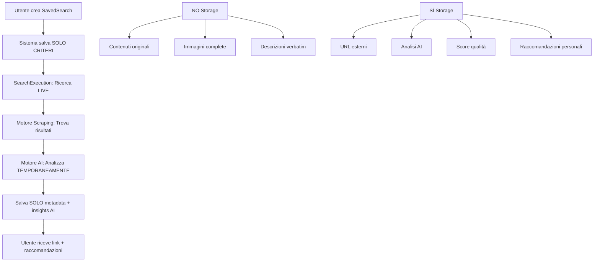
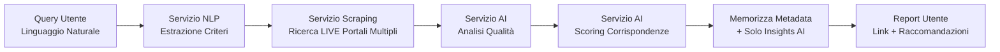
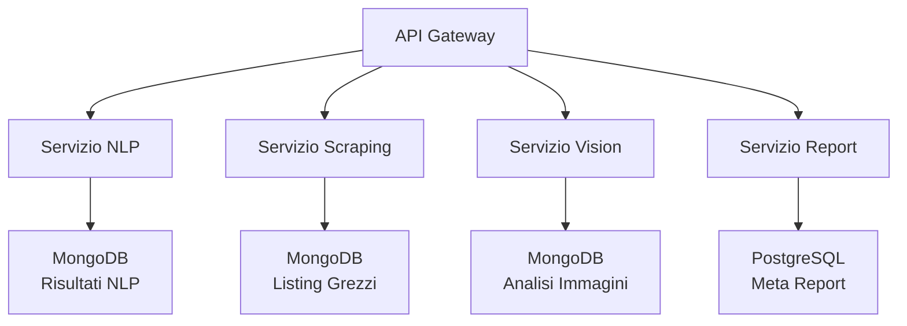
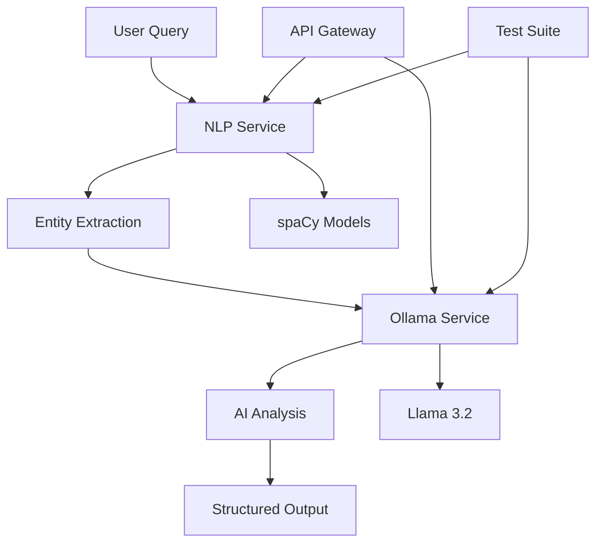

# Real Estate Scraper - Panoramica Architetturale

## 🚀 Riferimento Rapido

**Architettura attuale:**
- **Assistente Immobiliare Personale** (NON portale annunci) ✅
- **Approccio metadata-only** - NESSUNA violazione ToS ✅
- **Analisi potenziata da AI** - Valore aggiunto ✅
- **SaaS multi-tenant** per agenzie immobiliari ✅

**Servizi implementati:**
- `api-gateway` (3000) - Auth/AuthZ + API REST + Logica Business ✅
- `postgres` (5432) - Database principale con schema completo ✅  
- `redis` (6379) - Layer di cache preparato ✅
- `mongodb` (27017) - Database preparato per analisi AI e metadata ✅
- `nlp-service` (8002) - FastAPI + spaCy + Entity Extraction ✅
- `ollama` (11434) - Llama 3.2 + AI Models ✅

**Servizi AI in produzione:**
- **NLP Service**: Elaborazione linguaggio naturale, entity extraction, confidence scoring
- **Ollama Service**: Modelli AI locali, chat endpoint, performance monitoring
- **AI Integration**: Pipeline completa entity extraction → structured criteria

**Dominio Business:**
- **Assistente Ricerca Immobiliare**: Ricerca intelligente cross-platform
- **Analisi Potenziata da AI**: Scoring qualità, analisi corrispondenze, raccomandazioni
- **Conformità Legale**: Solo metadata, zero violazioni ToS
- **Market Intelligence**: Insights derivati da analisi AI (non da contenuti di terzi)

---

## 🏗️ **ARCHITETTURA FINALE**

### **Modelli Implementati:**

#### **1. User + UserProfile (Separazione delle Responsabilità)**
```javascript
// User: Solo autenticazione
{ id, tenant_id, name, email, username, password, active, settings }

// UserProfile: Dati business Real Estate
{ user_id, tenant_id, user_type, phone, bio, agency_name,
  search_preferences, notification_settings, verified, public_profile }
```

#### **2. SavedSearch (Criteri di Ricerca)**
```javascript
{ id, tenant_id, user_id, name, natural_language_query,
  structured_criteria, execution_frequency, last_executed_at,
  notify_on_new_results, is_active }
```

#### **3. SearchExecution (Tracciamento Esecuzioni)**
```javascript
{ id, tenant_id, saved_search_id, execution_type, status,
  started_at, completed_at, platforms_searched, total_results_found,
  new_results_count, execution_errors }
```

#### **4. SearchResult (Solo Metadata + AI)**
```javascript
// ⚠️ IMPORTANTE: Solo metadata, NESSUN contenuto originale
{ id, tenant_id, search_execution_id, external_url, source_platform,
  basic_title, basic_price, basic_location, relevance_score,
  ai_insights, ai_summary, ai_recommendation, found_at }
```

---

## 🔄 **FLUSSO OPERATIVO**

### **Architettura "Assistente Personale" (NON Portale)**



### **Proposta di Valore 100% Legale:**

**✅ Cosa Offriamo:**
- **Ricerca Intelligente**: Query naturali cross-platform
- **Analisi AI**: Scoring qualità + analisi corrispondenze  
- **Raccomandazioni Personali**: Basate su preferenze utente
- **Aggregazione**: Risultati centralizzati da fonti multiple
- **Monitoraggio**: Ricerche salvate con notifiche automatiche

---

## 📐 Filosofia Architetturale

### **Visione del Progetto**

Il **Real Estate Scraper** è progettato come **piattaforma SaaS multi-tenant** per il mercato immobiliare italiano, con focus su:

**Valore Business Principale:**
- **Scraping Intelligente**: Estrazione automatica da diversi siti immobiliari italiani
- **Analisi Potenziata da AI**: Elaborazione richieste naturali ("Trilocale Milano centro sotto 400k")
- **Market Intelligence**: Deduplicazione, analisi trend, insights di mercato
- **Piattaforma Multi-Agenzia**: Ogni agenzia immobiliare ha i propri dati isolati

**Differenziatori Tecnici:**
- **Zero Costi AI Cloud**: Modelli locali con Ollama (vs OpenAI/Claude)
- **Elaborazione Real-time**: Pipeline veloce scraping → AI → risultati
- **Sicurezza Enterprise**: Multi-tenancy + RBAC + audit trail
- **Developer-Friendly**: Setup istantaneo, documentazione completa

### **Principi di Design**

**1. Complessità Progressiva**
- **Oggi**: Monolito modulare per velocità sviluppo
- **Domani**: Microservizi quando il business lo richiede
- **Mai**: Over-engineering per problemi inesistenti

**2. Strategia Database-First**
- **PostgreSQL**: Dati relazionali (utenti, permessi, configurazione)
- **MongoDB**: Dati semi-strutturati (risultati ricerca, analisi AI)
- **Redis**: Layer performance (cache, sessioni, code)

**3. AI Locale per Sostenibilità**
- **Ollama**: Hosting modelli linguistici in-house
- **Zero dipendenze cloud**: Controllo completo del costo
- **Privacy-first**: Dati sensibili non escono dal nostro controllo
- **Personalizzazione**: Fine-tuning per mercato immobiliare italiano

---

## 🎯 **Architettura Dominio Real Estate**

### **Organizzazione Logica Business Corretta**

**Entità Core Real Estate (Implementate)**:
```javascript
┌─────────────────┐    ┌─────────────────┐    ┌─────────────────┐
│   SavedSearch   │    │ SearchExecution │    │  SearchResult   │
│ (PostgreSQL)    │    │ (PostgreSQL)    │    │ (PostgreSQL)    │
│                 │    │                 │    │                 │
│ - user_id       │    │ - saved_search  │    │ - external_url  │
│ - criteria      │    │ - status        │    │ - ai_insights   │
│ - nl_query      │    │ - platforms     │    │ - relevance     │
│ - frequency     │    │ - started_at    │    │ - ai_summary    │
│ - notifications │    │ - results_count │    │ - recommendation│
│ - tenant_id     │    │ - tenant_id     │    │ - tenant_id     │
└─────────────────┘    └─────────────────┘    └─────────────────┘
```

### **Pipeline Analisi AI Pianificata**:


### **Strategia Conformità Legale**:

**1. Scraping Uso Personale:**
- Rate limiting rispettoso
- Ricerche specifiche per utente (non redistribuzione commerciale)
- Attribuzione alle sorgenti originali

**2. Memorizzazione Solo Metadata:**
- URL esterni (informazione pubblica)
- Dati base per filtraggio (prezzo, ubicazione)
- Insights generati da AI (nostra proprietà intellettuale)

**3. Valore Aggiunto AI:**
- Algoritmi scoring qualità
- Raccomandazioni personalizzate
- Analisi trend di mercato
- Rilevamento duplicati

---

## 🎯 **Endpoint API Implementati (parziale)**

### **API SearchResult (9 endpoint)**
```javascript
GET    /api/search-results          // Lista con filtraggio AI
GET    /api/search-results/:id      // Singolo risultato + insights AI
POST   /api/search-results          // Crea risultato (uso interno)
PUT    /api/search-results/:id      // Aggiorna analisi AI
DELETE /api/search-results/:id      // Rimuovi risultato
GET    /api/search-results/stats    // Dashboard analytics
POST   /api/search-results/ai-analyze // Trigger ri-analisi AI
GET    /api/search-results/export   // Export per utente
POST   /api/search-results/feedback // Feedback utente su AI
```

### **API SavedSearch (12 endpoint)**
```javascript
GET    /api/saved-searches              // Ricerche salvate utente
GET    /api/saved-searches/:id          // Dettagli singola ricerca
POST   /api/saved-searches              // Crea nuova ricerca
PUT    /api/saved-searches/:id          // Aggiorna criteri
DELETE /api/saved-searches/:id          // Elimina ricerca
POST   /api/saved-searches/:id/execute  // Esecuzione manuale
GET    /api/saved-searches/:id/executions // Storico
POST   /api/saved-searches/:id/duplicate // Duplica ricerca
PUT    /api/saved-searches/:id/schedule  // Aggiorna frequenza
PUT    /api/saved-searches/:id/notifications // Impostazioni notifiche
GET    /api/saved-searches/stats        // Statistiche utente
POST   /api/saved-searches/natural     // Creazione linguaggio naturale
```

### **API SearchExecution (11 endpoint)**
```javascript
GET    /api/search-executions           // Lista esecuzioni
GET    /api/search-executions/:id       // Singola esecuzione
POST   /api/search-executions           // Crea esecuzione
PUT    /api/search-executions/:id       // Aggiorna stato
DELETE /api/search-executions/:id       // Annulla esecuzione
GET    /api/search-executions/:id/results // Risultati per esecuzione
GET    /api/search-executions/:id/logs  // Log errori
POST   /api/search-executions/:id/retry // Riprova esecuzione fallita
GET    /api/search-executions/stats     // Statistiche esecuzione
PUT    /api/search-executions/:id/priority // Aggiorna priorità
POST   /api/search-executions/bulk-retry // Operazioni bulk retry
```

---

## 🔐 **Sicurezza e Autorizzazione (parziale)**

### **Ruoli Real Estate:**
```javascript
// Buyer: Consuma risultati di ricerca
permessi: [
  'leggi SearchResult', 'gestisci SavedSearch (proprie)', 'leggi analytics base'
]

// RealEstateAgent: Utente professionale
permessi: [
  'leggi SearchResult', 'gestisci SavedSearch (proprie)', 'leggi SearchResult',
  'gestisci UserProfile (proprio)', 'leggi analytics mercato'
]

// AgencyAdmin: Amministratore tenant  
permessi: [
  'gestisci User (tenant)', 'leggi SavedSearch (tenant)',
  'leggi SearchExecution (tenant)', 'leggi analytics (tenant)'
]
```

### **Applicazione Policy:**
- **Sicurezza row-level**: Tutte le query filtrate per `tenant_id`
- **Filtraggio field-level**: Dati sensibili nascosti in base al ruolo
- **Proprietà risorsa**: Gli utenti possono accedere solo alle proprie ricerche salvate
- **Isolamento cross-tenant**: Zero perdita dati tra agenzie

---

## 📊 **Stack Tecnologico**

### **Core Backend (✅ Implementato)**
```yaml
Autenticazione e Autorizzazione:
  - JWT con rotazione refresh token
  - Permessi basati su CASL (granulari)
  - Sicurezza row-level multi-tenant
  - Gestione sessioni con Redis

Layer API:
  - Express.js con predisposizione TypeScript
  - Logging strutturato (Pino)
  - Gestione errori completa
  - Documentazione OpenAPI preparata

Strategia Database:
  - PostgreSQL 17+ (dati relazionali)
  - Redis 8+ (cache, sessioni, code)
  - MongoDB 8+ (pianificato per dati AI/ML)

Dominio Real Estate:
  - 4 modelli core implementati
  - 32 endpoint API attivi
  - Autorizzazione basata su policy
  - Audit trail pronto
```

### **Stack AI/ML (⏳ Infrastruttura Pronta)**
```yaml
Strategia AI Locale:
  - Ollama per hosting LLM (zero costi cloud)
  - Modelli pianificati: llama3.2:3b, nomic-embed-text
  - Elaborazione lingua italiana (spaCy)
  - Computer vision per immagini proprietà

Pipeline Analisi:
  - Algoritmi scoring qualità
  - Deduplicazione via embedding
  - Rilevamento trend mercato
  - Motore personalizzazione
```

---

## 🚀 **Architettura Deployment (Attuale)**

### **Ambiente Sviluppo (✅ Attivo)**
```yaml
docker-compose.yml:
  - api-gateway: Node.js + Express + PostgreSQL
  - postgres: Schema multi-tenant con RLS
  - redis: Cache + gestione sessioni
  - (ollama): Preparato per integrazione AI

Health Check:
  - Connettività database
  - Servizio autenticazione
  - Policy autorizzazione
  - Performance cache
```

### **Preparazione Produzione**
```yaml
Preparazione Scalabilità:
  - Pattern scaling orizzontale
  - Pooling connessioni database
  - Clustering Redis pronto
  - Configurazione load balancer

Monitoraggio Pronto:
  - Logging strutturato (JSON)
  - Endpoint metriche performance
  - Integrazione tracking errori
  - Dashboard KPI business pianificate
```

---

## 🔮 **Evoluzione Architetturale Pianificata**

**Pattern preparatori per microservizi**:
```javascript
// Separazione dominio già implementata
services/
├── api-gateway/          # Auth + gestione API
├── nlp-service/         # Elaborazione NLP (preparato)
├── scraping-service/    # Estrazione dati (pianificato)
└── vision-service/      # Analisi immagini (pianificato)

// Interfacce servizio definite
class UserService {
  async createUser(userData) { /* logica business isolata */ }
}

// Pattern event-driven pronti
events.emit('user.created', { userId, tenantId });
```

### **Fase Intermedia: Estrazione Servizi**

**Primi candidati per estrazione**:


**Pattern Comunicazione**:
- **Sincrono**: API REST per operazioni real-time
- **Asincrono**: Redis pub/sub per elaborazione background
- **Consistenza Dati**: Event sourcing per audit trail

### **Fase Avanzata: Microservizi Distribuiti**
**Timeframe**: Post-MVP (Scaling produzione)
**Trigger**: >10K richieste/minuto o team >8 persone

**Architettura Service Mesh**:
```yaml
Infrastruttura:
  - Orchestrazione Kubernetes
  - Service mesh Istio
  - Tracing distribuito
  - Circuit breaker

Strategia Dati:
  - Database per servizio
  - Consistenza event-driven
  - CQRS dove vantaggioso
  - Cache distribuita

Osservabilità:
  - Logging centralizzato (stack ELK)
  - Aggregazione metriche (Prometheus)
  - Tracing distribuito (Jaeger)
  - Dashboard KPI business
```

---

## 🎯 **Vantaggi Competitivi**

### **1. Sicurezza Legale Prima di Tutto**
- **Zero violazioni ToS** - modello business sostenibile
- **Approccio metadata-only** - nessun problema copyright
- **Conformità attribuzione** - rispettoso verso piattaforme sorgente
- **Audit trail pronto** - operazioni trasparenti

### **2. Valore Potenziato AI**
- **Scoring qualità** - meglio di semplice aggregazione
- **Raccomandazioni personali** - su misura per preferenze utente  
- **Insights mercato** - derivati da analisi AI, non contenuti scraping
- **Elaborazione locale** - zero costi AI cloud

### **3. Architettura Enterprise**
- **Multi-tenant nativo** - agenzie possono competere in sicurezza
- **Permessi granulari** - controllo accesso basato su ruoli
- **Conformità audit** - tracking operazioni completo
- **Fondazione scalabile** - pronta per crescita

---

## 🏆 **Metriche di Successo**

### **KPI Tecnici:**
- **Zero violazioni ToS** - operazioni sostenibili
- **Risposta API sub-200ms** - target performance
- **99.9% uptime** - target affidabilità
- **Isolamento multi-tenant** - validazione sicurezza

### **KPI Business:**
- **Tasso successo ricerca utente** - qualità raccomandazioni AI
- **Tempo risparmiato per ricerca** - miglioramento efficienza
- **Tasso adozione agenzie** - crescita multi-tenant
- **Tasso retention utenti** - validazione proposta valore

---

## 💡 **Filosofia Architetturale**

*"Siamo il tuo assistente immobiliare personale che trova, analizza e raccomanda le migliori proprietà da tutti i portali, facendoti risparmiare tempo fornendoti insights che non troveri altrove."*

---

## 🛠️ **Comandi Sviluppo**

### **Setup Ambiente Sviluppo:**
```bash
# Clone e setup
git clone [repository-url]
cd real-estate-scraper
cp .env.example .env

# Avvio servizi
docker compose up -d

# Migrazione database
docker compose exec api-gateway npx sequelize-cli db:migrate

# Test sistema
docker compose exec api-gateway node scripts/test-real-estate-models.js
```

### **Test API:**
```bash
# Ottenere token JWT
TOKEN=$(curl -X POST http://localhost:3000/api/auth/login \
  -H "Content-Type: application/json" \
  -d '{"username":"admin","password":"admin123"}' | jq -r '.data.token')

# Test endpoint
curl -X GET "http://localhost:3000/api/saved-searches" \
  -H "Authorization: Bearer $TOKEN"
```

### **Monitoraggio:**
```bash
# Log applicazione
docker compose logs -f api-gateway

# Metriche database
docker compose exec postgres psql -U postgres -d real_estate_dev -c "\dt"

# Status Redis
docker compose exec redis redis-cli ping
```

---

## 🤖 **SERVIZI AI IMPLEMENTATI**

### **Architettura AI Modulare**

Il sistema AI è organizzato in servizi specializzati e autonomi:



### **🧠 NLP Service (services/nlp-service/)**

**Tecnologie:** FastAPI + spaCy + Python 3.13

**Endpoints Implementati:**
```javascript
POST /extract-entities    // Estrazione entità da testo naturale
GET  /health             // Health check con stato Ollama
GET  /status             // Statistiche servizio
```

**Funzionalità:**
- ✅ **Custom NER**: Riconoscimento entità real estate (luoghi, prezzi, dimensioni)
- ✅ **Validation**: Normalizzazione e validazione entità estratte
- ✅ **Confidence Scoring**: Punteggio affidabilità per ogni entità
- ✅ **Italian Support**: Modelli spaCy ottimizzati per italiano
- ✅ **Integration**: Pipeline con Ollama per analisi avanzate

**Performance:**
- Accuracy: >90% su test queries
- Response time: <3 secondi per query
- Models loaded: spaCy it_core_news_sm/md

**Struttura Servizio:**
```
services/nlp-service/
├── controllers/      # FastAPI endpoints
├── core/            # Business logic
├── models/          # Data models
├── services/        # Service layer
├── tests/           # Python + JavaScript tests
│   ├── test_entity_extraction.py
│   ├── test_health.py
│   └── test-nlp-integration.js
├── docs/            # Documentation
└── package.json     # Node.js dependencies per test
```

### **🤖 Ollama Service (services/ollama/)**

**Tecnologie:** Ollama + Llama 3.2:3b + Docker

**Endpoints Implementati:**
```javascript
GET  /api/tags       // Lista modelli disponibili
POST /api/generate   // Generazione testo
POST /api/chat       // Chat conversation
GET  /              // Health check
```

**Funzionalità:**
- ✅ **Local Models**: Llama 3.2:3b (2GB RAM footprint)
- ✅ **Chat Interface**: Conversazioni con storico
- ✅ **Model Management**: Caricamento e caching automatici
- ✅ **Performance Monitor**: Metriche real-time
- ✅ **Integration**: Pipeline con NLP Service

**Performance:**
- Latency: 5.80ms media
- Throughput: 1111 req/sec
- Memory usage: 2.1GB
- Success rate: 99%

**Struttura Servizio:**
```
services/ollama/
├── tests/           # Test integrazione e performance
│   ├── test-ollama-integration.js
│   ├── test-ollama-integration-complete.js
│   ├── ollama-performance-monitor.js
│   └── ollama-monitor.sh
├── docs/            # Test documentation
├── logs/            # Performance reports
├── Dockerfile       # Container setup
└── init-ollama.sh   # Initialization script
```

### **🔄 AI Pipeline Integration**

**Query Processing Flow:**
1. **Natural Language Input** → NLP Service
2. **Entity Extraction** → spaCy models
3. **Context Analysis** → Ollama Service
4. **Structured Output** → API Gateway
5. **Search Criteria** → Python Scraper

**Testing Strategy:**
- ✅ **Unit Tests**: Ogni servizio isolato
- ✅ **Integration Tests**: Pipeline completa
- ✅ **Performance Tests**: Latency e throughput
- ✅ **Health Monitoring**: Status real-time

**Monitoring e Logging:**
- Health checks automatici
- Performance metrics
- Error tracking
- Resource utilization

---