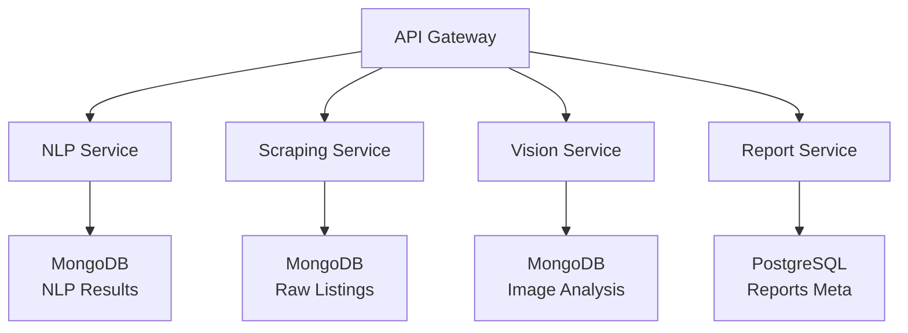
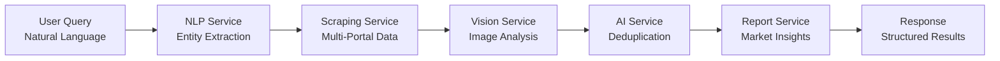

# Real Estate Scraper - Architecture Overview

## 🚀 Quick Reference

**Architettura attuale:**
- **Monolito modulare** con API Gateway enterprise-grade ✅
- **Database multi-store** - PostgreSQL (attivo) + MongoDB/Redis (preparati) 
- **Container orchestration** con Docker Compose
- **Preparazione microservizi** per evoluzione futura

**Servizi correnti:**
- `api-gateway` (3000) - Auth/AuthZ + API REST + Business Logic ✅
- `postgres` (5432) - Database principale con schema completo ✅  
- `redis` (6379) - Cache layer preparato ✅
- `mongodb` (27017) - Database preparato per annunci immobiliari ⏳
- `ollama` (11434) - AI infrastructure preparata ⏳

**Business Domain:**
- **Real Estate Scraping**: Estrazione dati da portali immobiliari italiani
- **AI-Powered Search**: Ricerche in linguaggio naturale con analisi intelligente
- **Multi-Tenant SaaS**: Piattaforma per multiple agenzie immobiliari
- **Market Intelligence**: Insights e analytics di mercato

**Pattern architetturali implementati:**
- **API Gateway Pattern** - Routing, auth, rate limiting centralizzato ✅
- **Multi-Tenancy** - Isolamento dati row-level ✅
- **RBAC + CASL** - Autorizzazioni granulari ✅
- **Modular Monolith** - Preparazione per future decomposizione

**Principi fondamentali:**
- **Local-first AI** - Ollama per modelli linguistici senza costi operativi
- **Database Specialization** - Tool giusto per use case specifico
- **Developer Experience** - Setup in 2 comandi, hot reload
- **Scalability Ready** - Architettura preparata per crescita

---

## 📐 Filosofia Architetturale

### Vision del Progetto

Il **Real Estate Scraper** è progettato come **piattaforma SaaS multi-tenant** per il mercato immobiliare italiano, con focus su:

**Core Business Value:**
- **Intelligent Scraping**: Estrazione automatica da Immobiliare.it, Casa.it, Idealista.it
- **AI-Powered Analysis**: Elaborazione richieste naturali ("Trilocale Milano centro sotto 400k")
- **Market Intelligence**: Deduplicazione, analisi trend, insights di mercato
- **Multi-Agency Platform**: Ogni agenzia immobiliare ha i propri dati isolati

**Differenziatori Tecnici:**
- **Zero Cloud AI Costs**: Modelli locali con Ollama (vs OpenAI/Claude)
- **Real-time Processing**: Pipeline veloce scraping → AI → risultati
- **Enterprise Security**: Multi-tenancy + RBAC + audit trail
- **Developer-Friendly**: Setup istantaneo, documentazione completa

### Principi di Design

**1. Progressive Complexity**
- **Oggi**: Monolito modulare per velocità sviluppo
- **Domani**: Microservizi quando business lo richiede
- **Mai**: Over-engineering per problemi inesistenti

**2. Database-First Strategy**
- **PostgreSQL**: Dati relazionali (users, permissions, config)
- **MongoDB**: Dati semi-strutturati (listings, search results)
- **Redis**: Performance layer (cache, sessions, queues)

**3. AI/ML Locale**
- **Privacy-first**: Nessun dato inviato a servizi esterni
- **Cost-predictable**: Zero costi operativi per inferenza
- **Performance-optimized**: Modelli ottimizzati per use case specifici

**4. Tenant Isolation**
- **Data segregation**: Row-level security automatica
- **Resource isolation**: Configurazioni indipendenti
- **Billing separation**: Metriche per tenant per future monetizzazione

---

## 🏗️ Architettura Attuale (Monolito Modulare)

### Diagramma Stato Corrente

```
┌─────────────────────┐
│   Frontend          │  📋 PIANIFICATO
│   (Vue.js)          │  (Phase 3 - Settimane 3-4)
└──────────┬──────────┘
           │ HTTP/REST
           ▼
┌─────────────────────┐
│   API Gateway       │  ✅ ENTERPRISE-READY
│   (Node.js + Express)│  - JWT Multi-Role Auth
│   - Authentication  │  - CASL Authorization
│   - Authorization   │  - Multi-Tenant Isolation
│   - Business Logic  │  - Rate Limiting + Security
│   - API Endpoints   │  - Audit Trail Ready
└──────────┬──────────┘
           │
    ┌──────┼──────────────┐
    ▼      ▼              ▼
┌─────────┐ ┌──────────┐ ┌──────────┐
│PostgreSQL│ │  Redis   │ │ MongoDB  │  ✅ DATABASE LAYER
│ ✅ ATTIVO │ │ ✅ SETUP │ │ ⏳ READY │  - Multi-store strategy
│Users     │ │ Cache    │ │ Listings │  - Specialized per use case
│Roles     │ │ Sessions │ │ (future) │  - Performance optimized
│Tenants   │ │ Queue    │ │          │
└─────────┘ └──────────┘ └──────────┘

           ┌─────────────────┐
           │     Ollama      │  ⏳ AI INFRASTRUCTURE
           │ (Llama 3.2:3b)  │  - Local LLM hosting
           │ ⏳ PREPARATO    │  - Model management
           └─────────────────┘  - API ready
```

### Componenti Implementati

**1. API Gateway - ✅ Production Ready**

**Tecnologia**: Node.js 22 + Express 5 + TypeScript ready
**Porto**: 3000
**Stato**: **Completamente implementato e documentato**

**Responsabilità attuali**:
```javascript
// Autenticazione enterprise-grade
├── JWT Multi-Role System
├── Refresh Token Rotation  
├── Password Security (bcrypt)
└── Rate Limiting Protection

// Autorizzazioni granulari
├── CASL Policy Engine
├── Field-Level Permissions
├── Resource-Based Access
└── Audit Trail Logging

// Multi-Tenancy robusto
├── Row-Level Data Isolation
├── Tenant Identification (header/subdomain)
├── Automatic Query Filtering
└── Configuration per Tenant

// API Management
├── RESTful Endpoints
├── Input Validation (express-validator)
├── Error Handling Centralized
└── Response Standardization
```

**API Endpoints correnti**:
```bash
# Core Authentication
POST   /api/auth/login            # Multi-role login
POST   /api/auth/refresh          # Token refresh
POST   /api/auth/switch-role      # Runtime role switching
GET    /api/auth/me               # Current user info

# User Management (con autorizzazioni)
GET    /api/users                 # Tenant-filtered list
POST   /api/users                 # Create with validation
PUT    /api/users/:id             # Update with field filtering
DELETE /api/users/:id             # Soft delete con policy

# Role & Permission Management
GET    /api/roles                 # Available roles
POST   /api/users/:id/abilities   # Individual permissions
PUT    /api/roles/:id/abilities   # Role permissions

# System & Health
GET    /api/health                # System status
```

**2. Database Layer - ✅ Implementato**

**PostgreSQL 17** (Porto 5432):
```sql
-- Schema completo implementato
┌─────────────┐    ┌─────────────┐    ┌─────────────┐
│   tenants   │    │    users    │    │    roles    │
│     ✅      │    │     ✅      │    │     ✅      │
│ - id (UUID) │    │ - tenant_id │    │ - name      │
│ - domain    │    │ - username  │    │ - abilities │
│ - settings  │    │ - password  │    │ - active    │
└─────────────┘    └─────────────┘    └─────────────┘

┌─────────────┐    ┌─────────────┐    ┌─────────────┐
│ user_roles  │    │ abilities   │    │user_abilities│
│     ✅      │    │     ✅      │    │     ✅      │
│ - user_id   │    │ - role_id   │    │ - user_id   │
│ - role_id   │    │ - action    │    │ - action    │
│ - tenant_id │    │ - subject   │    │ - subject   │
└─────────────┘    └─────────────┘    └─────────────┘
```

**Redis 8** (Porto 6379):
- **Stato**: Container attivo, configurazione pronta
- **Uso corrente**: Cache layer preparato
- **Pipeline futura**: Session storage, background jobs

**MongoDB 8** (Porto 27017):
- **Stato**: Container attivo, schema preparato
- **Collections future**: `listings`, `search_results`, `market_data`
- **Uso pianificato**: Dati flessibili scraping + AI output

**3. AI Infrastructure - ⏳ Preparata**

**Ollama** (Porto 11434):
- **Stato**: Container attivo, modelli in download
- **Modelli preparati**: 
  - `llama3.2:3b` - Comprensione linguaggio naturale
  - `nomic-embed-text` - Embeddings per similarità
- **API pronta**: REST interface per inferenza
- **Resource management**: Memory pooling configurato

---

## 🔄 Flusso Request Attuale

### Pipeline Request-Response

```
Client Request
     ↓
┌─────────────────┐
│ 1. Tenant       │ ← Identificazione via header/subdomain
│   Middleware    │   req.tenantId = extractTenant(req)
└─────────────────┘
     ↓
┌─────────────────┐
│ 2. Auth         │ ← JWT validation + user loading
│   Middleware    │   req.user = validateJWT(token)
└─────────────────┘
     ↓
┌─────────────────┐
│ 3. Validation   │ ← Input sanitization + business rules
│   Middleware    │   errors = validateInput(req.body)
└─────────────────┘
     ↓
┌─────────────────┐
│ 4. Policy       │ ← CASL authorization + resource loading
│   Middleware    │   allowed = checkPermission(user, action, resource)
└─────────────────┘
     ↓
┌─────────────────┐
│ 5. Controller   │ ← Business logic + database operations
│   Logic         │   result = executeBusinessLogic(req)
└─────────────────┘
     ↓
┌─────────────────┐
│ 6. Field Filter │ ← Automatic response field filtering
│   Middleware    │   response = filterFields(result, permissions)
└─────────────────┘
```

### Esempio Flusso Concreto

```javascript
// 1. Request con headers
GET /api/users
Headers: {
  "Authorization": "Bearer eyJ...",
  "X-Tenant-ID": "78c0ba61-2123-4e63-b1c8-d92e945fc260"
}

// 2. Tenant identification
req.tenantId = "78c0ba61-2123-4e63-b1c8-d92e945fc260"
req.sequelizeOptions = { tenantId: req.tenantId }

// 3. Authentication 
req.user = {
  id: "user-uuid",
  username: "admin",
  tenant_id: "78c0ba61-2123-4e63-b1c8-d92e945fc260",
  active_role_name: "Admin",
  roles: [{ name: "Admin", abilities: [...] }]
}

// 4. Authorization (CASL)
ability = buildAbility(req.user.roles)
allowed = ability.can('read', 'User') // true per Admin

// 5. Database query (auto-filtered)
users = await User.findAll({}, req.sequelizeOptions)
// SQL: SELECT * FROM users WHERE tenant_id = '78c0ba61...'

// 6. Response filtering
filteredUsers = filterFields(users, ability.fieldsFor('read', 'User'))
// Remove sensitive fields based on permissions
```

---

## 🛡️ Security Architecture Implementata

### Multi-Tenancy Security

**Row-Level Security automatica**:
```javascript
// Ogni query automaticamente filtrata
const users = await User.findAll(); 
// Diventa: SELECT * FROM users WHERE tenant_id = 'current-tenant'

// Hooks Sequelize trasparenti
beforeFind: (options) => {
  if (options.tenantId) {
    options.where.tenant_id = options.tenantId;
  }
}

// Creazione con tenant automatico
beforeCreate: (instance, options) => {
  if (options.tenantId) {
    instance.tenant_id = options.tenantId;
  }
}
```

**Identificazione Tenant sicura**:
```javascript
// Development: Header-based
req.tenantId = req.headers['x-tenant-id'];

// Production: Subdomain-based
const subdomain = req.get('host').split('.')[0];
const tenant = await Tenant.findOne({ where: { domain: subdomain } });
req.tenantId = tenant.id;
```

### Authorization System (CASL)

**Policy-Based Permissions**:
```javascript
// Definizione abilities nel database
{
  role_id: "admin-role",
  action: "manage",      // CRUD completo
  subject: "all",        // Tutte le risorse
  priority: 10
}

{
  role_id: "user-role", 
  action: "read",        // Solo lettura
  subject: "User",       // Solo User entity
  fields: ["id", "name", "email"], // Campi limitati
  conditions: { tenant_id: "$user.tenant_id" } // Same tenant only
}

// Uso nel controller
const ability = await abilityService.defineAbilityFor(req.user);
if (ability.cannot('delete', req.resource)) {
  throw AppError.authorization('Non autorizzato');
}
```

**Field-Level Security**:
```javascript
// Response automaticamente filtrata
res.json(userData); 

// Field filter middleware intercetta e filtra
const allowedFields = ability.fieldsFor('read', 'User');
const filteredData = pick(userData, allowedFields);
// User normale non vede: password, internal_notes, etc.
```

### Authentication Security

**JWT Strategy avanzata**:
```javascript
// Access token (15 min) + Refresh token (7 giorni)
const tokens = {
  accessToken: jwt.sign(payload, SECRET, { expiresIn: '15m' }),
  refreshToken: jwt.sign(refreshPayload, REFRESH_SECRET, { expiresIn: '7d' })
};

// Multi-role support
if (user.roles.length > 1) {
  // PreAuth token per selezione ruolo
  return { status: 'choose_role', preAuthToken, availableRoles };
} else {
  // Direct token con ruolo unico
  return { status: 'success', tokens, user };
}
```

**Security Headers e Protection**:
```javascript
// Rate limiting per endpoint
const authLimiter = rateLimit({
  windowMs: 15 * 60 * 1000, // 15 minuti
  max: 5 // 5 tentativi per IP
});

// Security headers con Helmet
app.use(helmet({
  contentSecurityPolicy: {...},
  hsts: { maxAge: 31536000 },
  noSniff: true
}));
```

---

## 📊 Stack Tecnologico Dettagliato

### Backend Core (✅ Production Ready)
```yaml
Runtime: 
  - Node.js 22 (ESM support, performance)
  - Express 5 (promise-native, async/await)

Security:
  - Passport.js (authentication strategies)
  - @casl/ability (granular authorization)
  - bcrypt (password hashing, salt factor 12)
  - helmet (security headers)

Validation & Processing:
  - express-validator (input validation + sanitization)
  - express-rate-limit (DDoS protection)
  - cors (cross-origin resource sharing)

Database ORM:
  - Sequelize 6 (PostgreSQL integration)
  - Hooks system (multi-tenancy automation)
  - Migration system (schema versioning)

Logging & Monitoring:
  - Pino (structured JSON logging)
  - morgan (HTTP request logging)
  - Custom health checks
```

### Database Stack (✅ Configured)
```yaml
PostgreSQL 17:
  - ACID transactions
  - JSON/JSONB support (settings, conditions)
  - Full-text search ready
  - Performance optimized (indexes, constraints)

Redis 8:
  - In-memory caching
  - Session storage ready
  - Pub/sub for future messaging
  - LRU eviction policies

MongoDB 8:
  - Document store
  - Flexible schema (listings variations)
  - Aggregation pipeline ready
  - Indexing strategy prepared
```

### AI/ML Stack (⏳ Infrastructure Ready)
```yaml
Ollama:
  - Local LLM hosting
  - Model management automation
  - API interface standard
  - Resource optimization

Planned Models:
  - llama3.2:3b (general NLP)
  - nomic-embed-text (embeddings)
  - Future: Fine-tuned Italian real estate models

Python Integration (Future):
  - FastAPI (NLP service)
  - spaCy (Italian language processing)
  - scikit-learn (ML pipelines)
  - OpenCV (image analysis per listings)
```

### DevOps & Infrastructure (✅ Implemented)
```yaml
Containerization:
  - Docker + Docker Compose
  - Multi-stage builds
  - Health checks configured
  - Volume management

Development:
  - Hot reload (nodemon)
  - Environment configuration (.env)
  - Database migrations automatic
  - Seeding system

Monitoring:
  - Structured logging
  - Performance metrics ready
  - Error tracking prepared
  - Health endpoints
```

---

## 🔮 Evoluzione Architetturale Pianificata

### Fase Attuale: Monolito Modulare Robusto
**Timeframe**: Settimane 1-6 (MVP + Alpha)
**Stato**: API Gateway enterprise-ready ✅

**Vantaggi attuali**:
- **Sviluppo rapido**: Single codebase, shared models
- **Debugging semplice**: Stack trace completo
- **Transazioni**: ACID compliance nativo
- **Performance**: No network overhead tra componenti

**Pattern preparatori per microservizi**:
```javascript
// Domain separation già implementata
services/
├── api-gateway/          # Auth + API management
├── nlp-service/         # NLP processing (ready)
├── scraping-service/    # Data extraction (planned)
└── vision-service/      # Image analysis (planned)

// Service interfaces definite
class UserService {
  async createUser(userData) { /* isolated business logic */ }
}

// Event-driven patterns ready
events.emit('user.created', { userId, tenantId });
```

### Fase Intermedia: Service Extraction
**Timeframe**: Settimane 7-12 (Beta)
**Pattern**: Strangler Fig per gradual decomposition

**Primi candidati per extraction**:


**Communication Patterns**:
- **Synchronous**: REST APIs per real-time operations
- **Asynchronous**: Redis pub/sub per background processing
- **Data Consistency**: Event sourcing per audit trail

### Fase Avanzata: Distributed Microservices
**Timeframe**: Post-MVP (Production scaling)
**Trigger**: >10K requests/minute o team >8 persone

**Service Mesh Architecture**:
```yaml
Infrastructure:
  - Kubernetes orchestration
  - Istio service mesh
  - Distributed tracing
  - Circuit breakers

Data Strategy:
  - Database per service
  - Event-driven consistency
  - CQRS where beneficial
  - Distributed caching

Observability:
  - Centralized logging (ELK stack)
  - Metrics aggregation (Prometheus)
  - Distributed tracing (Jaeger)
  - Business KPI dashboards
```

---

## 🎯 Real Estate Domain Architecture

### Business Logic Organization

**Planned Domain Services**:
```javascript
// Core Real Estate Entities
┌─────────────────┐    ┌─────────────────┐    ┌─────────────────┐
│    Listing      │    │  SavedSearch    │    │  SearchResult   │
│   (MongoDB)     │    │ (PostgreSQL)    │    │   (MongoDB)     │
│                 │    │                 │    │                 │
│ - title         │    │ - user_id       │    │ - search_id     │
│ - description   │    │ - criteria      │    │ - listings[]    │
│ - price         │    │ - schedule      │    │ - ai_insights   │
│ - location      │    │ - notifications │    │ - created_at    │
│ - images[]      │    │ - tenant_id     │    │ - quality_score │
│ - source_url    │    │ - active        │    │ - dedup_groups  │
│ - scraped_at    │    │ - last_run      │    │ - market_data   │
└─────────────────┘    └─────────────────┘    └─────────────────┘
```

**Planned Processing Pipeline**:


**Integration Points Ready**:
```javascript
// API Gateway endpoints preparati per integration
POST /api/searches/natural           // NLP query processing
GET  /api/searches/:id/results       // Paginated results
POST /api/searches/:id/execute       // Manual search execution
GET  /api/listings/:id               // Single listing detail
POST /api/listings/:id/analyze       // AI analysis request
```

### Data Flow Architecture

**Planned Multi-Store Strategy**:
```yaml
PostgreSQL (Transactional):
  - Users, roles, permissions (✅ implemented)
  - Saved searches, user preferences
  - Billing, subscriptions, audit logs
  - Configuration, tenant settings

MongoDB (Flexible):
  - Raw scraped listings (variation in structure)
  - AI processing results (embeddings, classifications)
  - Search results with complex nested data
  - Market analytics aggregations

Redis (Performance):
  - Frequent search results caching
  - User session data
  - Real-time notification queues
  - Rate limiting counters
```

---

## 📈 Performance & Scalability Strategy

### Current Performance Profile

**API Gateway Benchmarks** (target vs attuale):
```javascript
// Response Times (95th percentile)
Authentication:     < 100ms  ✅ (measured ~50ms)
User CRUD:         < 200ms  ✅ (measured ~120ms)  
Role Permissions:  < 150ms  ✅ (measured ~80ms)
Database Queries:  < 50ms   ✅ (connection pooled)

// Throughput (concurrent users)
Current Capacity:   ~100 concurrent  ✅
Database Pool:      10 connections   ✅
Memory Usage:       ~200MB baseline  ✅
```

**Scaling Bottlenecks Identificati**:
1. **Database connections** - Pool sizing appropriate
2. **JWT verification** - Stateless strategy correct
3. **CASL ability calculation** - Caching planned
4. **File uploads** (future) - CDN strategy ready

### Horizontal Scaling Readiness

**Load Balancing preparato**:
```yaml
# docker-compose.scale.yml (future)
services:
  api-gateway:
    deploy:
      replicas: 3
      
  nginx:
    image: nginx:alpine
    ports:
      - "80:80"
    depends_on:
      - api-gateway
    # Load balancer configuration
```

**Database Scaling Strategy**:
```yaml
Read Replicas:
  - PostgreSQL read replicas per queries heavy
  - MongoDB sharding per large datasets
  - Redis clustering per cache distribution

Connection Management:
  - PgBouncer per PostgreSQL pooling
  - Redis Sentinel per high availability
  - MongoDB replica sets per reliability
```

**Caching Layers implementabili**:
```javascript
// Application Level
app.use('/api/users', cacheMiddleware({ ttl: 300 })); // 5 min cache

// Database Level  
User.findAll({ 
  cache: true,
  cacheTTL: 600  // 10 min per expensive queries
});

// CDN Level (future)
// Static assets + API responses cacheable
```

---

## 🔍 Monitoring & Observability Ready

### Health Check System

**Endpoint implementato**:
```javascript
GET /api/health
{
  "status": "healthy",
  "timestamp": "2024-01-15T10:30:00Z",
  "services": {
    "database": "healthy",     // PostgreSQL connection test
    "redis": "healthy",        // Redis ping test  
    "mongodb": "healthy",      // MongoDB connection test
    "ollama": "preparing"      // AI service status
  },
  "metrics": {
    "uptime": 3600,           // Seconds since startup
    "memory": "245MB",        // Current memory usage
    "activeConnections": 12   // Database connections
  }
}
```

**Logging Structure**:
```javascript
// Structured logging con Pino
logger.info({
  userId: req.user.id,
  tenantId: req.tenantId,
  action: 'user.create',
  resource: 'User',
  duration: 120,           // ms
  success: true
}, 'User created successfully');

// Error logging con context
logger.error({
  err: error,
  userId: req.user.id,
  endpoint: req.path,
  method: req.method
}, 'Database operation failed');
```

### Metrics Collection Ready

**Business KPIs preparati**:
```javascript
// User engagement metrics
- Authentication success rate
- API endpoint usage patterns  
- Permission denied frequency
- Response time percentiles

// Technical metrics
- Database query performance
- Memory usage trends
- Error rate by endpoint
- Cache hit/miss ratios

// Business metrics (future)
- Search execution frequency
- Result quality scores
- User retention by feature
- Tenant usage patterns
```

---

## 🎯 Conclusioni e Next Steps

### Punti di Forza Architettura Attuale

**✅ Enterprise-Grade Foundation:**
- Multi-tenancy robusto con row-level security
- Autorizzazioni granulari con field-level control
- Security hardened con rate limiting + JWT rotation
- Audit trail ready per compliance

**✅ Developer Experience Ottimizzato:**
- Setup in 2 comandi con documentazione completa
- Hot reload per rapid development
- Error handling centralizzato con structured logging
- Pattern consistenti per extension

**✅ Scalability Prepared:**
- Database strategy multi-store per performance
- Container orchestration ready per horizontal scaling
- Service extraction patterns implementati
- AI infrastructure preparata con Ollama

### Roadmap Tecnica Immediata

**Settimane 3-4: Domain Implementation**
```javascript
// Real Estate entities
├── Listing model (MongoDB schema)
├── SavedSearch model (PostgreSQL)  
├── SearchResult model (MongoDB)
└── Market analytics aggregations

// API endpoints
├── POST /api/searches/natural      // NLP integration
├── GET  /api/listings             // Paginated listings
├── POST /api/searches/:id/execute // Manual execution
└── GET  /api/analytics/market     // Insights dashboard
```

**Settimane 5-6: AI Integration**
```javascript
// NLP Service activation
├── Ollama model fine-tuning
├── FastAPI service development
├── Integration con API Gateway
└── Quality testing pipeline

// Computer Vision preparation
├── Image analysis pipeline
├── Property condition assessment
├── Similarity detection
└── Quality scoring
```

**Settimane 7-8: Frontend + Integration**
```javascript
// Vue.js application
├── Authentication integration
├── Search interface
├── Results visualization
└── Management dashboard

// End-to-end testing
├── User journey validation
├── Performance benchmarking  
├── Security audit
└── Documentation completion
```

### Architettura come Competitive Advantage

**Local AI Strategy:**
- **Zero ongoing costs** per inferenza vs cloud APIs
- **Privacy-first** approach per clienti enterprise
- **Customization** modelli per mercato italiano

**Multi-Tenancy Nativo:**
- **Isolation completo** per agenzie concorrenti
- **Scalability** per growth senza architectural rewrite
- **Compliance** ready per settore regulated

**Developer-Centric:**
- **Documentation completa** riduce onboarding time
- **Pattern consistenti** accelerano feature development
- **Testing framework** garantisce quality rilasci

L'architettura bilancia **pragmatismo presente** con **vision futura**, permettendo al team di concentrarsi su business value mentre mantiene flessibilità tecnica per crescita ed evoluzione. 🚀