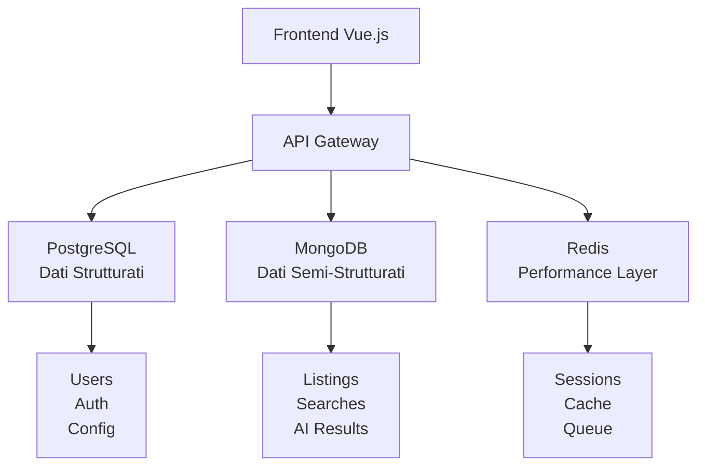

# Database Guide - Real Estate Scraper

## 🚀 Quick Reference

**Architettura Database:**
- **PostgreSQL**: User management, auth, configurazioni, audit (porta 5432)
- **MongoDB**: Annunci immobiliari, search results, cache flessibile (porta 27017)  
- **Redis**: Session storage, caching, message queue (porta 6379)

**Comandi Essenziali:**
```bash
# Migrations e setup
npx sequelize-cli db:migrate
npx sequelize-cli db:seed:all --seeders-path src/seeders/base

# Debug database
docker compose exec postgres psql -U postgres -d real_estate_scraper
docker compose logs -f postgres

# Reset completo (ATTENZIONE!)
docker compose down -v && docker compose up -d
```

**Modelli Core PostgreSQL:**
- **Tenant**: Multi-tenancy (`tenants` table)
- **User**: Utenti sistema (`users` table) 
- **Role**: Ruoli (`roles` table)
- **Ability**: Permessi granulari (`abilities` table)
- **UserRole**: Associazione utenti-ruoli (`user_roles` table)
- **UserAbility**: Permessi individuali (`user_abilities` table)

**Convenzioni Chiave:**
- UUID come chiavi primarie (sicurezza + distribuzione)
- Soft delete automatico (`deleted_at`)
- Audit trail (`created_by`, `updated_by`, timestamps)
- Multi-tenancy automatico (hooks Sequelize)
- Password hashing automatico (bcrypt)

**Files Importanti:**
- `src/models/index.js` - Bootstrap modelli Sequelize
- `src/migrations/` - Schema database versioning  
- `src/seeders/base/` - Dati iniziali sistema
- `src/config/sequelize-hooks.js` - Hooks multi-tenancy
- `src/middleware/db-context.js` - Context utente per audit

---

## 📖 Architettura Database

### Strategia Multi-Database

Il sistema utilizza un approccio **multi-database** per ottimizzare prestazioni e scalabilità:



**PostgreSQL** (Relazionale):
- User management e autenticazione
- Sistema permessi e ruoli
- Configurazioni sistema
- Audit trail e logging
- Compliance ACID per integrità dati

**MongoDB** (Documento):
- Annunci immobiliari scrappati
- Risultati ricerche salvate  
- Output elaborazioni AI
- Schema flessibile per dati eterogenei

**Redis** (In-Memory):
- Session storage JWT
- Cache query frequenti
- Message queue processing
- Performance optimization

### Isolamento Multi-Tenant

Ogni tenant ha **completo isolamento** dei dati attraverso:
- Campo `tenant_id` in ogni tabella business
- Hooks Sequelize automatici per filtri
- Middleware di identificazione tenant
- Validazioni a livello applicativo

Esempio utilizzo:
```javascript
// Query automaticamente filtrata per tenant corrente
const users = await User.findAll(); 
// Sequelize aggiunge: WHERE tenant_id = 'current-tenant-id'
```

## 🏗️ Schema PostgreSQL

### Modelli Core

Il sistema PostgreSQL si basa su **6 modelli principali**:

```mermaid
erDiagram
    Tenant ||--o{ User : "tenant_id"
    User ||--o{ UserRole : "user_id"
    Role ||--o{ UserRole : "role_id"
    Role ||--o{ Ability : "role_id"
    User ||--o{ UserAbility : "user_id"
    
    Tenant {
        uuid id PK
        string name
        string domain UK
        string code UK
        boolean active
        jsonb settings
        timestamps
    }
    
    User {
        uuid id PK
        uuid tenant_id FK
        string name
        string email UK
        string username UK
        string password
        boolean active
        jsonb settings
        uuid created_by
        uuid updated_by
        timestamps
    }
    
    Role {
        uuid id PK
        string name UK
        string description
        timestamps
    }
    
    Ability {
        uuid id PK
        uuid role_id FK
        string action
        string subject
        jsonb conditions
        array fields
        boolean inverted
        integer priority
        timestamps
    }
    
    UserRole {
        uuid id PK
        uuid user_id FK
        uuid role_id FK
        timestamps
    }
    
    UserAbility {
        uuid id PK
        uuid user_id FK
        uuid tenant_id FK
        string action
        string subject
        jsonb conditions
        timestamps
    }
```

### Caratteristiche Schema

**UUID Come Chiavi Primarie:**
```javascript
id: {
  type: DataTypes.UUID,
  defaultValue: DataTypes.UUIDV4,
  primaryKey: true
}
```

Vantaggi UUID:
- Sicurezza (no enumeration attacks)
- Distribuzione (no conflitti)
- Immutabilità (stabili nel tempo)
- Previsibilità (generabili offline)

**Soft Delete (Paranoid):**
I modelli utilizzano `paranoid: true` per eliminazioni logiche invece di fisiche. Record "eliminati" hanno `deleted_at` impostato ma rimangono nel database.

**Audit Trail:**
Tutti i modelli tracciano automaticamente:
- `created_by` / `updated_by` (chi ha fatto l'operazione)
- `created_at` / `updated_at` (quando è successo)

## 🔧 Sequelize Implementation

### Struttura Modelli

Il sistema organizza i modelli in **3 categorie**:

```javascript
// File singoli per modelli core
const importModels = [
  'tenant', 'user', 'role', 'ability', 'user-role', 'user-ability'
];

// File raggruppati per organizzazione
const lookupModelsFile = 'lookup-models.js';    // Tabelle di lookup
const historyModelsFile = 'history-models.js';   // Audit completo
```

### Hooks Multi-Tenancy

Gli hooks automatici garantiscono l'isolamento senza intervento manuale:

```javascript
// Auto-aggiunta tenant_id in creazione
sequelize.addHook('beforeCreate', (instance, options) => {
  if (options.tenantId && !isSystemModel(instance)) {
    instance.tenant_id = options.tenantId;
  }
});

// Auto-filtro tenant_id in tutte le query
sequelize.addHook('beforeFind', (options) => {
  if (options.tenantId && modelHasTenantId(options.model)) {
    options.where.tenant_id = options.tenantId;
  }
});
```

### Relazioni e Associazioni

Le relazioni tra modelli seguono pattern standard Sequelize:

```javascript
// Esempio: User con tenant e ruoli
User.belongsTo(models.Tenant, { foreignKey: 'tenant_id', as: 'tenant' });
User.belongsToMany(models.Role, { through: models.UserRole, as: 'roles' });
```

### Scopes e Metodi Helper

I modelli includono scopes per query comuni:

```javascript
// Scopes di esempio
scopes: {
  active: { where: { active: true } },
  withRoles: { include: [{ model: Role, as: 'roles' }] },
  withoutSensitive: { attributes: { exclude: ['password'] } }
}

// Metodi helper di esempio
hasRole(roleName) { /* logica verifica ruolo */ }
validPassword(password) { /* verifica password */ }
```

## 🚀 Migrations e Seeders

### Sistema Migrations

Le migrations gestiscono l'evoluzione dello schema in ordine cronologico:

```bash
src/migrations/
├── 20250619123016-create-tenants.js      # 1. Tenant base
├── 20250619123026-create-users.js        # 2. Utenti sistema
├── 20250619123045-create-roles.js        # 3. Ruoli  
├── 20250619123046-create-abilities.js    # 4. Permessi
├── 20250619123051-create-user-roles.js   # 5. Associazioni
├── 20250619123056-create-user-abilities.js # 6. Permessi individuali
└── 20250619123103-add-core-indexes.js    # 7. Indici performance
```

**Esecuzione Automatica**: Le migrations vengono eseguite automaticamente all'avvio tramite `docker-entrypoint.sh`.

### Sistema Seeders

I seeders popolano dati iniziali essenziali:

```bash
# Seeders base (sempre eseguiti)
src/seeders/base/
├── 01_system_user.js     # Utente sistema (ID fisso)
├── 02_base_roles.js      # Ruoli standard (admin, user)
├── 03_base_abilities.js  # Permessi di base
└── 04_admin_user.js      # Admin iniziale (admin/admin123)
```

**Dati Critici Creati:**
- **System User**: ID fisso `00000000-0000-0000-0000-000000000000` per operazioni automatiche
- **Admin User**: Credenziali `admin/admin123` (da cambiare in produzione!)
- **Ruoli Base**: `admin` e `user` con permessi appropriati

## 🔐 Sicurezza Database

### Password Security

Le password vengono automaticamente hashate tramite hooks Sequelize utilizzando bcrypt con salt factor 12.

### Context Middleware

Il middleware `db-context.js` imposta il contesto utente PostgreSQL per abilitare trigger di audit che tracciano chi effettua modifiche ai dati.

### Tenant Isolation

Il middleware `tenantMiddleware.js` identifica il tenant tramite:
1. Header `X-Tenant-ID` (sviluppo)
2. Subdomain extraction (produzione)

Una volta identificato, tutte le query vengono automaticamente filtrate per quel tenant.

## 📊 Performance e Ottimizzazioni

### Indici Database

Indici strategici per prestazioni ottimali:

```javascript
// Esempi indici critici
await queryInterface.addIndex('users', ['email'], { unique: true });
await queryInterface.addIndex('users', ['tenant_id']);
await queryInterface.addIndex('abilities', ['action', 'subject']);
await queryInterface.addIndex('user_roles', ['user_id', 'role_id'], { unique: true });
```

### Eager Loading

Per ottimizzare le query, utilizzare sempre il precaricamento delle relazioni necessarie:

```javascript
// Query ottimizzata
const user = await User.findByPk(userId, {
  include: ['tenant', 'roles', 'userAbilities']
});
```

### Connection Pooling

Sequelize è configurato con pool di connessioni (max: 10, min: 2) per gestire efficacemente il carico.

## 🛠️ Workflow Development

### Aggiungere Nuova Entità

Per estendere il modello dati:

```bash
# 1. Genera migration
npx sequelize-cli migration:generate --name create-new-entity

# 2. Modifica migration file con pattern standard
# 3. Crea modello in src/models/
# 4. Aggiorna relazioni nei modelli esistenti
# 5. Esegui migration
npx sequelize-cli db:migrate
```

**Convenzioni Obbligatorie**:
- UUID come chiave primaria
- Campo `tenant_id` se applicabile  
- Campi audit (`created_by`, `updated_by`)
- Timestamps automatici
- Soft delete se appropriato (`paranoid: true`)

### Debug e Troubleshooting

**Visualizzare Query SQL**:
In development, abilitare logging SQL in configurazione Sequelize.

**Reset Database Completo**:
```bash
# ATTENZIONE: Cancella tutto!
docker compose down -v && docker compose up -d
```

**Verifica Stato Connessioni**:
```bash
docker compose exec postgres psql -U postgres -c "SELECT count(*) FROM pg_stat_activity;"
```

## 🎯 Pattern e Best Practices

### Query Sicure

```javascript
// ✅ CORRETTO: Query tenant-aware
const getUsers = async (req) => {
  return await User.findAll({
    ...req.sequelizeOptions,  // Include tenantId automatico
    where: { active: true }
  });
};

// ❌ SBAGLIATO: Query senza tenant context  
const getUsers = async () => {
  return await User.findAll({ where: { active: true } }); // Restituisce tutti i tenant!
};
```

### Transazioni

Per operazioni multi-step utilizzare sempre transazioni per garantire consistenza dei dati.

### Validazioni

Implementare validazioni sia a livello database (constraints) che a livello modello Sequelize per robustezza.

## 📈 Monitoring e Maintenance

### Health Checks

Il sistema include health check automatici per verificare lo stato della connessione database.

### Backup Strategy

```bash
# Backup PostgreSQL
docker compose exec postgres pg_dump -U postgres real_estate_scraper > backup.sql

# Restore
docker compose exec -T postgres psql -U postgres -d real_estate_scraper < backup.sql
```

### Performance Monitoring

In development, abilitare `benchmark: true` in Sequelize per monitorare query lente (>1s).

---

Questa guida fornisce una panoramica completa del sistema database. Per approfondimenti su autenticazione e permessi, consulta [01-auth-system-guide.md](./01-auth-system-guide.md) e [02-permission-system-guide.md](./02-permission-system-guide.md).