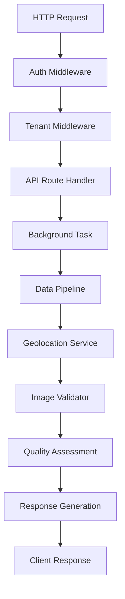

# Architettura - Python Scraper Service

## 🏗️ Panoramica Architetturale

Il Python Scraper Service implementa un'**architettura a microservizio** con pattern **Pipeline Processing** per trasformare dati immobiliari raw in SearchResult strutturati e normalizzati.

## 🎯 Design Principles

### **1. Stateless + Real-Time**
- **Zero persistenza locale**: solo metadata in memoria durante processing
- **Processing on-demand**: nessun pre-processing o cache
- **Event-driven**: risposta immediata con background processing

### **2. Multi-Tenant by Design**
- **Isolation completo**: dati separati per tenant a tutti i livelli
- **Security first**: validation automatica accesso cross-tenant
- **Context propagation**: tenant context attraverso tutta la pipeline

### **3. Resilience + Observability**
- **Graceful degradation**: fallback su errori esterni
- **Structured logging**: correlation tracking per debug
- **Health monitoring**: real-time status tutti i componenti

## 📐 Architecture Layers

### **Layer 1: API Gateway + Middleware**

```
HTTP Request → [Auth] → [Tenant] → [Logging] → [Rate Limit] → Business Logic
     ↓            ↓        ↓         ↓           ↓
[JWT Validate] [Context] [Struct] [Per-Tenant] [Route Handler]
```

#### **Middleware Stack**
1. **AuthMiddleware**: JWT validation + user extraction
2. **TenantMiddleware**: Context setup + isolation enforcement  
3. **LoggingMiddleware**: Request correlation + structured logs
4. **RateLimitMiddleware**: Per-tenant request limiting

#### **API Layer Components**
- **FastAPI Framework**: Async-first con auto-documentation
- **Pydantic Models**: Schema validation + serialization
- **Background Tasks**: Processing asincrono per performance
- **Exception Handlers**: Error normalization + user-friendly responses

### **Layer 2: Processing Pipeline**

```
Raw Property Data → [Mapper] → [Geolocation] → [Images] → [Quality] → SearchResult
        ↓              ↓          ↓           ↓         ↓
   [Scraped JSON] [Normalize] [Coordinates] [Validate] [Score] [Final Format]
```

#### **Pipeline Components**

##### **SearchResultMapper** (`services/data_pipeline.py`)
**Responsabilità**: Trasformazione dati scraped → SearchResult standard

**Processing Steps**:
1. **Field Mapping**: Mappatura campi platform-specific → schema unificato
2. **Data Cleaning**: Normalizzazione testi e rimozione anomalie
3. **Price Processing**: Conversione valute e formato standardizzato
4. **Property Details**: Estrazione e validation metadati tecnici

**Input Example**:
```python
scraped_property = {
    "titolo": "Appartamento Milano - Via Montenapoleone",
    "prezzo": "€ 450.000",
    "superficie": "85 mq",
    "locali": "3 locali",
    "url": "https://immobiliare.it/12345"
}
```

**Output Example**:
```python
search_result = {
    "external_url": "https://immobiliare.it/12345",
    "basic_title": "Appartamento Milano",
    "basic_price": 450000,
    "property_details": {
        "rooms": 3,
        "surface_area": 85
    }
}
```

##### **GeolocationProcessor** (`services/geolocation_service.py`)
**Responsabilità**: Normalizzazione e arricchimento dati location

**Funzionalità Core**:
- **City Normalization**: "Milano Centro" → "Milano" (standardizzazione)
- **Zone Classification**: "centro", "periferia", "suburbs" detection
- **Coordinates Extraction**: Lat/lng da address quando disponibili
- **Relevance Scoring**: Match con criteri ricerca location

**Database Built-in**:
```python
ITALIAN_CITIES = {
    "milano": {
        "province": "Milano", 
        "region": "Lombardia",
        "aliases": ["milan", "mailand"],
        "zones": {
            "centro": ["centro storico", "brera", "navigli"],
            "periferia": ["porta garibaldi", "isola"]
        }
    }
}
```

**Processing Logic**:
```python
def normalize_location(location_string: str) -> LocationData:
    # 1. Text cleaning e normalization
    # 2. City/province detection via regex
    # 3. Zone type classification
    # 4. Coordinate lookup se disponibili
    # 5. Relevance scoring vs search criteria
```

##### **ImageValidator** (`services/image_validator.py`)
**Responsabilità**: Quality assessment e validation immagini

**Validation Pipeline**:
1. **URL Pattern Check**: Regex validation per format supportati
2. **HTTP Head Request**: Verifica esistenza senza download completo  
3. **Image Dimension**: Estrazione size via Pillow (selective download)
4. **Quality Scoring**: Assessment basato su dimensioni e format
5. **Duplicate Detection**: Identificazione immagini identiche

**Quality Scoring Algorithm**:
```python
def calculate_image_quality_score(images: List[str]) -> float:
    # Base score da numero immagini (più immagini = meglio)
    # Penalty per immagini troppo piccole (<300px)
    # Bonus per high-resolution (>800px) 
    # Deduction per duplicates o broken links
    return normalized_score  # 0.0 - 1.0
```

### **Layer 3: Integration + Infrastructure**

#### **Multi-Tenant Architecture**

##### **TenantDataIsolation** (`api/middleware/tenant_middleware.py`)
**Pattern**: Context-based isolation con automatic filtering

```python
class TenantDataIsolation:
    def filter_results_by_tenant(self, results: List[dict], tenant_id: str):
        # Automatic filtering di tutti i risultati per tenant
        return [r for r in results if r.get('tenant_id') == tenant_id]
    
    def validate_tenant_access(self, resource_id: str, tenant_id: str):
        # Validation accesso cross-tenant resources
        # Raises ForbiddenError se access denied
```

**Context Propagation**:
```python
# Context threading attraverso tutta la pipeline
tenant_context = {
    "tenant_id": user.tenant_id,
    "user_id": user.id,
    "role": user.role,
    "request_id": generate_request_id()
}

# Automatic injection in tutti i services
await data_pipeline.process(property_data, context=tenant_context)
```

##### **Background Task Management**
**Pattern**: Async processing con tenant isolation

```python
from fastapi import BackgroundTasks

@router.post("/execute-search")
async def execute_search(background_tasks: BackgroundTasks, ...):
    # 1. Immediate response con execution_id
    execution_id = generate_execution_id()
    
    # 2. Background processing con tenant context
    background_tasks.add_task(
        process_search_execution,
        execution_id=execution_id,
        search_criteria=criteria,
        tenant_context=tenant_ctx
    )
    
    return {"search_execution_id": execution_id, "status": "pending"}
```

#### **Error Handling Architecture**

##### **Layered Error Handling**
```python
# 1. Global Exception Handler
@app.exception_handler(Exception)
async def global_exception_handler(request, exc):
    logger.error("Unhandled exception", error=str(exc), path=request.url.path)
    return JSONResponse(
        status_code=500,
        content={"error": {"code": "INTERNAL_ERROR", "message": "Internal server error"}}
    )

# 2. Service-Level Error Handling  
class DataPipelineService:
    async def process_property(self, data: dict) -> dict:
        try:
            return await self._transform_data(data)
        except ValidationError as e:
            # Known error - return fallback
            logger.warning("Data validation failed", error=str(e))
            return self._generate_fallback_result(data)
        except Exception as e:
            # Unexpected error - re-raise per global handler
            logger.error("Unexpected processing error", error=str(e))
            raise ProcessingError("Failed to process property data")

# 3. Client-Facing Error Format
{
    "error": {
        "code": "VALIDATION_ERROR",
        "message": "Invalid search criteria", 
        "details": {"field": "max_price", "reason": "Must be > min_price"},
        "request_id": "req_abc123"
    }
}
```

#### **Monitoring + Observability**

##### **Structured Logging**
```python
import structlog

# Logger configuration
structlog.configure(
    processors=[
        structlog.contextvars.merge_contextvars,
        structlog.processors.add_log_level,
        structlog.processors.StackInfoRenderer(),
        structlog.dev.ConsoleRenderer()
    ]
)

# Usage pattern
logger = structlog.get_logger()
logger.info(
    "Processing search execution",
    tenant_id=tenant_id,
    search_execution_id=execution_id,
    property_count=len(properties),
    processing_start_time=time.time()
)
```

##### **Health Check System**
```python
class HealthChecker:
    async def check_component_health(self) -> dict:
        checks = {
            "data_pipeline": await self._check_data_pipeline(),
            "geolocation_service": await self._check_geolocation(),
            "image_validator": await self._check_image_validator()
        }
        
        overall_status = "healthy" if all(c["status"] == "healthy" for c in checks.values()) else "degraded"
        
        return {
            "status": overall_status,
            "components": checks,
            "timestamp": datetime.utcnow().isoformat()
        }
```

## 🔄 Data Flow Architecture

### **Request Lifecycle**



### **Processing Pipeline Detail**

#### **Phase 1: Data Ingestion**
```python
# Input: Raw scraped property data
raw_data = {
    "titolo": "Appartamento Milano Centro",
    "prezzo": "€ 450.000",
    "indirizzo": "Via Montenapoleone, Milano",
    "superficie": "85 mq", 
    "locali": "3 locali + cucina",
    "piano": "2° piano",
    "url": "https://immobiliare.it/12345",
    "immagini": ["img1.jpg", "img2.jpg", ...]
}
```

#### **Phase 2: Field Mapping + Normalization** 
```python
# SearchResultMapper processing
mapped_data = {
    "external_url": "https://immobiliare.it/12345",
    "basic_title": "Appartamento Milano Centro", 
    "basic_price": 450000,  # Normalized to integer
    "basic_location": "Milano, Centro",
    "property_details": {
        "rooms": 3,  # Extracted from "3 locali"
        "surface_area": 85,  # Extracted from "85 mq"
        "floor": 2,  # Extracted from "2° piano"
    }
}
```

#### **Phase 3: Geolocation Processing**
```python
# GeolocationProcessor enhancement
geo_enhanced = {
    ...mapped_data,
    "location_data": {
        "city": "Milano",
        "province": "Milano",
        "region": "Lombardia", 
        "zone_type": "centro",  # Classified based on address
        "coordinates": {
            "lat": 45.4642,
            "lng": 9.1900
        },
        "relevance_score": 0.95  # Match vs search criteria
    }
}
```

#### **Phase 4: Image Validation**
```python
# ImageValidator processing
image_processed = {
    ...geo_enhanced,
    "images": {
        "validated_urls": [
            "https://img.immobiliare.it/foto1.jpg",  # Valid + accessible
            "https://img.immobiliare.it/foto2.jpg"   # Valid + accessible
        ],
        "image_count": 8,  # Original count
        "valid_count": 2,  # Post-validation count
        "quality_score": 0.75  # Based on dimensions + count
    }
}
```

#### **Phase 5: AI Insights + Quality Scoring**
```python
# Final SearchResult with AI insights
final_result = {
    ...image_processed,
    "relevance_score": 0.89,  # Overall match score
    "ai_insights": {
        "quality_score": 0.85,  # Data completeness + quality
        "recommendation": "Ottima corrispondenza criteri ricerca",
        "summary": "Appartamento ben posizionato in zona centrale con buone caratteristiche",
        "strengths": ["Posizione centrale", "Metratura adeguata"],
        "considerations": ["Piano basso", "Immagini limitate"]
    }
}
```

## 🔧 Configuration Architecture

### **Environment-Based Configuration**

#### **Configuration Layers**
1. **Base Config** (`config/settings.py`): Default values
2. **Environment Config** (`config/environment.py`): Environment-specific overrides  
3. **Runtime Config**: Dynamic configuration da environment variables

```python
# settings.py
class Settings(BaseSettings):
    # Application 
    APP_NAME: str = "python-scraper"
    VERSION: str = "1.0.0"
    ENVIRONMENT: str = "development"
    
    # API Configuration
    HOST: str = "0.0.0.0"
    PORT: int = 8002
    MAX_CONCURRENT_REQUESTS: int = 100
    
    # Processing Configuration
    MAX_SEARCH_RESULTS: int = 100
    DEFAULT_SEARCH_RESULTS: int = 20
    PROCESSING_TIMEOUT_SECONDS: int = 300
    
    # Multi-Tenant Configuration
    TENANT_ISOLATION_ENABLED: bool = True
    
    # Logging Configuration
    LOG_LEVEL: str = "INFO"
    
    class Config:
        env_file = ".env"
```

### **Service Configuration**

#### **Pipeline Configuration**
```python
PIPELINE_CONFIG = {
    "data_mapping": {
        "price_currency": "EUR",
        "default_surface_unit": "mq",
        "room_count_patterns": [r"(\d+)\s*local", r"(\d+)\s*stanz"]
    },
    "geolocation": {
        "italian_cities_db": "config/italian_cities.json",
        "coordinate_precision": 4,  # Decimal places
        "zone_classification_enabled": True
    },
    "image_validation": {
        "min_image_width": 300,
        "min_image_height": 200, 
        "max_file_size_mb": 10,
        "timeout_seconds": 5
    },
    "quality_scoring": {
        "min_completeness_score": 0.6,
        "image_weight": 0.3,
        "location_weight": 0.4,
        "details_weight": 0.3
    }
}
```

## 🚀 Deployment Architecture

### **Container Architecture**

#### **Docker Configuration**
```dockerfile
# Multi-stage build for optimization
FROM python:3.12-slim as base
WORKDIR /app

# Dependencies layer (cached)
COPY requirements/ requirements/
RUN pip install -r requirements/base.txt

# Application layer
COPY . .
EXPOSE 8002

# Health check
HEALTHCHECK --interval=30s --timeout=10s --start-period=5s --retries=3 \
    CMD curl -f http://localhost:8002/health || exit 1

CMD ["python", "app.py"]
```

#### **Docker Compose Integration**
```yaml
python-scraper:
  build: ./services/python-scraper
  ports:
    - "8002:8002"
  environment:
    - ENVIRONMENT=production
    - LOG_LEVEL=info
  volumes:
    - ./logs:/app/logs
  depends_on:
    - redis
  networks:
    - app-network
```

### **Scalability Considerations**

#### **Horizontal Scaling**
- **Stateless Design**: Nessuna session state, completamente scalabile
- **Load Balancing**: Multiple instances behind load balancer
- **Background Tasks**: Queue-based processing per high throughput

#### **Performance Optimization**
- **Async Processing**: FastAPI + asyncio per I/O non-blocking
- **Connection Pooling**: HTTP client con connection reuse
- **Memory Management**: Garbage collection tuning per long-running processes

#### **Resource Limits**
```yaml
deploy:
  resources:
    limits:
      memory: 512M
      cpus: '0.5'
    reservations:
      memory: 256M
      cpus: '0.25'
```

---

**🏗️ Questa architettura è progettata per essere scalabile, manutenibile e resiliente. Per implementazione dettagliata, consulta i file sorgente in ogni directory.**
